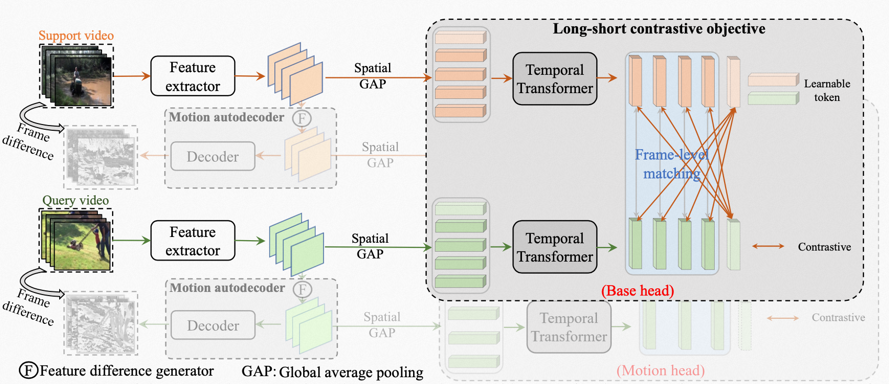

# MoLo: Motion-augmented Long-short Contrastive Learning for Few-shot Action Recognition (CVPR-2023)
### Official Pytorch Implementation of MoLo



> **MoLo: Motion-augmented Long-short Contrastive Learning for Few-shot Action Recognition**<br>
> Xiang Wang,  Shiwei Zhang,  Zhiwu Qing, Changxin Gao,  Yingya Zhang,  Deli Zhao, and Nong Sang

<!-- > [Paper](https://arxiv.org/abs/2304.00946) -->

> **Abstract:** *Current state-of-the-art approaches for few-shot action recognition achieve promising performance by conducting frame-level matching on learned visual features. However, they generally suffer from two limitations: i) the matching procedure between local frames tends to be inaccurate due to the lack of guidance to force long-range temporal perception; ii) explicit motion learning is usually ignored, leading to partial information loss. To address these issues, we develop a Motion-augmented Long-short Contrastive Learning (MoLo) method that contains two crucial components, including a long-short contrastive objective and a motion autodecoder. Specifically, the long-short contrastive objective is to endow local frame features with long-form temporal awareness by maximizing their agreement with the global token of videos belonging to the same class. The motion autodecoder is a lightweight architecture to reconstruct pixel motions from the differential features, which explicitly embeds the network with motion dynamics. By this means, MoLo can simultaneously learn long-range temporal context and motion cues for comprehensive few-shot matching. To demonstrate the effectiveness, we evaluate MoLo on five standard benchmarks, and the results show that MoLo favorably outperforms recent advanced methods.*


This code is based on [pytorch-video-understanding](https://github.com/alibaba-mmai-research/TAdaConv) codebase, which provides a comprehensive video understanding solution for video classification and temporal detection. 

## Installation

Requirements:
- Python>=3.6
- torch>=1.5
- torchvision (version corresponding with torch)
- simplejson==3.11.1
- decord>=0.6.0
- pyyaml
- einops
- oss2
- psutil
- tqdm
- pandas

optional requirements
- fvcore (for flops calculation)

Or you can create environments with the following command:
```
conda env create -f environment.yaml
```

## Data preparation

First, you need to download the datasets from their original source (If you have already downloaded, please ignore this step
):

- [SSV2](https://20bn.com/datasets/something-something#download)
- [Kinetics](https://github.com/Showmax/kinetics-downloader)
- [UCF101](https://www.crcv.ucf.edu/data/UCF101.php)
- [HMDB51](https://serre-lab.clps.brown.edu/resource/hmdb-a-large-human-motion-database/#Downloads)

Then, prepare data according to the [splits](configs/projects/MoLo) we provide.

## Running
The entry file for all the runs are `runs/run.py`. 

Before running, some settings need to be configured in the config file. 
The codebase is designed to be experiment friendly for rapid development of new models and representation learning approaches, in that the config files are designed in a hierarchical way.

For an example run, open `configs/projects/MoLo/kinetics100/MoLo_K100_1shot_v1.yaml`

A. Set `DATA.DATA_ROOT_DIR` and `DATA.DATA_ANNO_DIR` to point to the kinetics dataset, 

B. Set the valid gpu number `NUM_GPUS`

Then the codebase can be run by:
```
python runs/run.py --cfg configs/projects/MoLo/kinetics100/MoLo_K100_1shot_v1.yaml
```

## Citation
If you find this code useful, please cite our paper.

~~~~
@inproceedings{wang2023MoLo,
  title={MoLo: Motion-augmented Long-short Contrastive Learning for Few-shot Action Recognition},
  author={Wang, Xiang and Zhang, Shiwei and Qing, Zhiwu and Gao, Changxin and Zhang, Yingya and Zhao, Deli and Sang, Nong},
  booktitle={Proceedings of the IEEE/CVF Conference on Computer Vision and Pattern Recognition},
  year={2023}
}
~~~~
